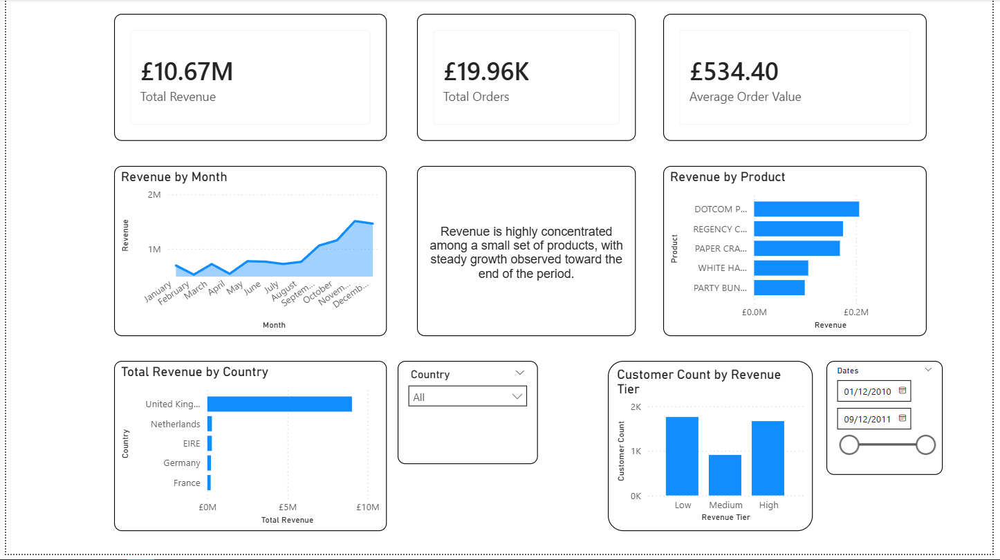

## Dashboard Preview

# Sales Analytics Dashboard (SQL + Power BI)

## Objective
This project analyses UK retail transaction data to uncover revenue trends, customer behaviour, and product performance using SQL and Power BI.

## Dataset
The dataset contains transactional sales data including invoice dates, product descriptions, quantities, prices, and customer IDs.

## Data Cleaning
- Removed cancelled transactions
- Handled missing Customer IDs
- Converted InvoiceDate using UK locale formatting
- Created Revenue column (Quantity × Unit Price)
- Built customer segmentation based on total spend

## Key Metrics
- Total Revenue
- Total Orders
- Average Order Value

## Key Insights
- Revenue is highly concentrated among a small number of products
- Revenue is heavily concentrated in the United Kingdom, indicating limited geographic diversification.
- Revenue shows steady growth toward the end of the period
- A small segment of high-value customers contributes disproportionately to revenue

## Tools Used
- SQL
- Power BI

## Limitations
- Dataset covers a limited time period
- Customer segmentation thresholds are arbitrary
- No profit/cost data available
